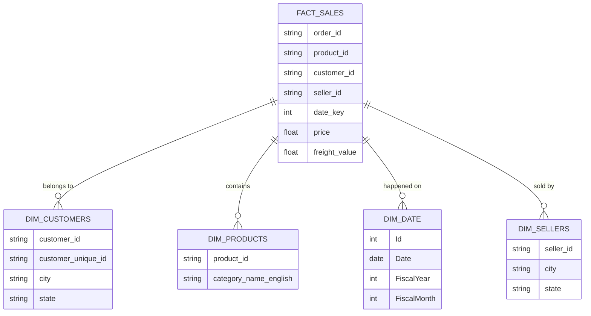

# 📘 توثيق مشروع مستودع البيانات (Olist DWH)

هذا المشروع يهدف إلى تحويل بيانات متجر Olist من نظام تشغيلي إلى مستودع بيانات جاهز للتحليل.

---

## 🏗️ هندسة النظام (Architecture)

استخدمنا نهج **Star Schema** (مخطط النجمة) لأنه الأبسط والأسرع في استخراج التقارير.

---

## 🛠️ خطة نقل البيانات (ETL Pipeline)

تم بناء العملية باستخدام **Python & Pandas** داخل ملف `ETL.ipynb`:
1.  **Extract (استخراج):** قراءة البيانات من ملف `olist.sqlite` وجدول التواريخ.
2.  **Transform (تحويل):** 
    *   ربط جداول الطلبات وعناصر الطلبات.
    *   ترجمة أسماء فئات المنتجات للإنجليزية.
    *   تنظيف التواريخ لتناسب مفتاح الربط (DateKey).
3.  **Load (تحميل):** حفظ البيانات النهائية في قاعدة بيانات تحليلية من نوع **PostgreSQL**.

---

## 🚀 تحسين الأداء (Performance)

*   **الفهارس (Indexing):** قمنا بإنشاء فهارس على مفاتيح الربط في جدول الحقائق (Product, Customer, Date) لتسريع عمليات الـ JOIN والاستعلامات.
*   **PostgreSQL:** اخترنا PostgreSQL لقدرته العالية على معالجة البيانات الكبيرة ودعمه لعمليات الاستعلام المتزامنة بشكل أفضل من SQLite.

---

## 📝 ملاحظات وافتراضات

*   **لماذا Star Schema؟** لأنه الأفضل للمستخدمين غير التقنيين لكتابة استعلامات SQL بسيطة ومباشرة.
*   **التبسيط:** قمنا بدمج البيانات الأساسية فقط لضمان سرعة الأداء وسهولة الفهم (Keep It Simple).
*   **البيانات المفقودة:** تم استبدال أسماء الفئات المفقودة بكلمة "Unknown" لضمان عدم ضياع أي سجلات مبيعات.
