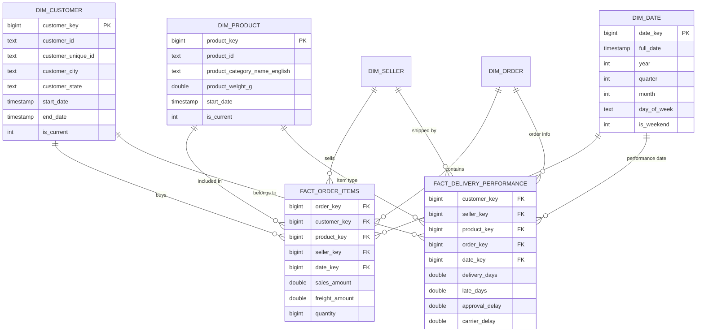

# 📘 توثيق مستودع بيانات Olist المتطور (Advanced Olist DWH)

هذا المشروع يطبق بنية مستودع بيانات احترافية تعتمد على **Star Schema** مع دعم لـ **Surrogate Keys** و **SCD Type 2**.

---

## 🏗️ مخطط قاعدة البيانات (Data Warehouse Schema)

تم تصميم المستودع ليكون مركزياً وقابلاً للتوسع، مع فصل الأداء اللوجستي عن أداء المبيعات.

---

## 🛠️ خطة نقل البيانات (ETL Pipeline)

1.  **Extract:** استخراج البيانات من SQLite وجداول CSV.
2.  **Transform:**
    *   **Surrogate Keys:** إنشاء مفاتيح بديلة (SK) لكل الأبعاد لضمان استقلالية البيانات.
    *   **SCD Type 2:** إضافة أعمدة تتبع التغيير التاريخي (`start_date`, `end_date`, `is_current`).
    *   **Calculations:** حساب أيام التأخير، زمن الموافقة، وزمن الشحن لجدول الأداء.
3.  **Load:** تحميل البيانات إلى **PostgreSQL المحلي** مع تعريف الأنواع الصحيحة.

---

## 🚀 كيفية التشغيل (Local Deployment)

1.  تأكد من أن قاعدة بيانات PostgreSQL تعمل على جهازك.
2.  قم بإنشاء قاعدة بيانات باسم `ecommerce_dwh` (أو عدل الاسم في الكود).
3.  افتح ملف `ETL.ipynb` وقم بتعديل قسم **CONFIGURATION** ببياناتك الخاصة (اسم المستخدم، كلمة المرور، المنفذ).
4.  شغل جميع الخلايا لتنفيذ عملية نقل البيانات.
